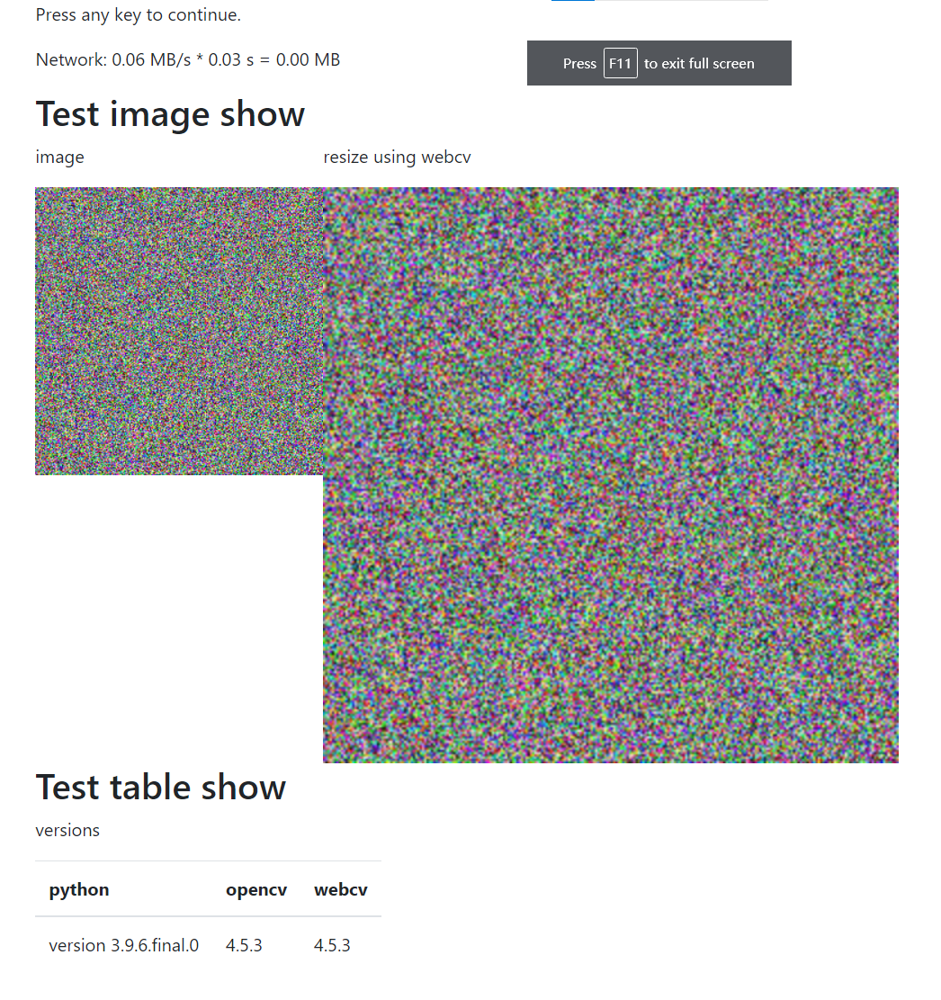

# Webcv

Webcv is a simple wrapper that can implements displaying images, text, and tables via web browsers.

This project is based on [quart](https://pgjones.gitlab.io/quart/index.html) that requires python 3.7+. For older version of Python, please use [webcv-gevent](https://github.com/wanzysky/webcv-gevent) instead.

## Installation

`pip install webcv`


## Sample Usage


```python

import sys

import numpy as np
from webcv import webcv


webcv.head_show("h1", "Test image show")

image = np.random.randint(0, 256, (256, 256, 3), dtype=np.uint8)

webcv.imshow("image", image)
webcv.imshow("resize using webcv", webcv.resize(image, (512, 512)))

# response in 30 seconds
webcv.waitKey(30000)

webcv.head_show("h1", "Test table show")
webcv.table_show("versions", [
    ["python", "opencv", "webcv"],
    [f"version {'.'.join(str(v) for v in sys.version_info)}", cv.__version__, webcv.__version__],
    ])

webcv.waitKey()
```

By running the code above, your terminal will display something like:

```
#####################################################################
#                                                                   #
#   The server is running at: http://my-server-ip:4732              #
#                                                                   #
#####################################################################
 * Serving Quart app 'webcv'
 * Environment: production
 * Please use an ASGI server (e.g. Hypercorn) directly in production
 * Debug mode: False
 * Running on http://0.0.0.0:4732 (CTRL + C to quit)
```

Copy paste the address into your browser to view (you may need ssh forward if you are using a remote server):


## Acknowledgement

The project was inspired by a Megvii tool.

## License

MIT License
